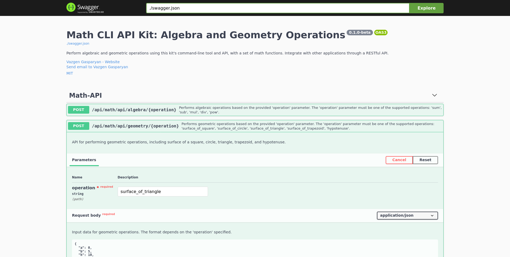

# Math CLI API Kit

[](https://github.com/gasparyanvazgen/math-cli-api-kit/blob/master/LICENSE)
[](https://github.com/gasparyanvazgen/math-cli-api-kit/issues)
[](https://github.com/gasparyanvazgen/math-cli-api-kit/stargazers)
[](https://github.com/gasparyanvazgen/math-cli-api-kit/network)

The Math CLI API Kit is a Python package and command-line tool for performing algebraic and geometric operations. It provides a set of mathematical functions and exposes them through both a command-line interface and a RESTful API.



## Table of Contents

- [Installation](#installation)
- [Usage](#usage)
- [API Documentation](#api-documentation)
- [Contributing](#contributing)
- [License](#license)

## Installation

The Math CLI API Kit can be installed directly from GitHub using `pip`:

```bash
pip install git+https://github.com/gasparyanvazgen/math-cli-api-kit.git
```

Ensure that a virtual environment is created before installing to manage your project's dependencies.

## Usage

### Command-Line Interface

The Math CLI API Kit offers a range of algebraic and geometric commands via the command-line interface. Operations such as addition, subtraction, multiplication, and more are supported.

Here are some examples:

```bash
python -m math_cli_api_kit.cli algebra sum -x 5 -y 3
python -m math_cli_api_kit.cli geometry surface_of_square -a 4
```

Additional details on the available commands and their usage can be found by running:

```bash
python -m math_cli_api_kit.cli --help
```

### API

The Math CLI API Kit provides a RESTful API for programmatic access to mathematical operations. To run the API server, use the following script:

```python
# server.py

from math_cli_api_kit.api import create_app

app = create_app(__name__)

if __name__ == "__main__":
    app.run(host="localhost", port=8000)
```

The server can be started with the following command:

```bash
sanic server:app
```

Alternatively, the server can be run using plain Python:

```bash
python server.py
```

This action launches the server, making it accessible at http://localhost:8000/. API endpoints provided by the Math CLI API Kit can be accessed through this server. If there's a need to change the port when running the server, you can use the following command:

```bash
sanic server:app --port=8005
```

However, when running it using `python server.py`, the server operates on port 8005, as specified in the code given in `server.py`:

```python
# the rest of the code

if __name__ == "__main__":
    app.run(host="localhost", port=8005)
```

You can access the Swagger UI for the API at http://localhost:8005/swagger/

## API Documentation

For detailed documentation of the API endpoints, please consult the [official OpenAPI documentation](https://github.com/gasparyanvazgen/math-cli-api-kit/blob/master/API_DOC.md).

## Contributing

Contributions to the Math CLI API Kit are welcome. To contribute or report an issue, please refer to the [contributing guidelines](CONTRIBUTING.md).

## License

The Math CLI API Kit is an open-source project released under the MIT License. For more details, please review the [LICENSE](https://github.com/gasparyanvazgen/math-cli-api-kit/blob/master/LICENSE).

---

For inquiries or assistance, please feel free to contact the project owner, Vazgen Gasparyan, at [gvazgen@outlook.com](mailto:gvazgen@outlook.com).

**Thank you for using the Math CLI API Kit!**
